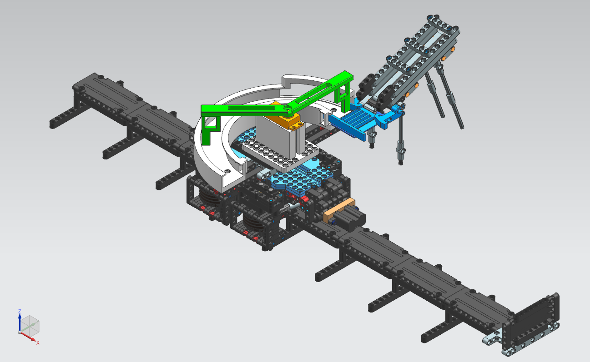
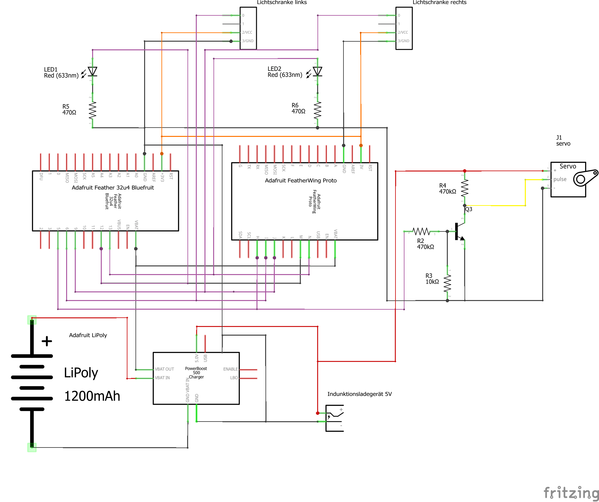
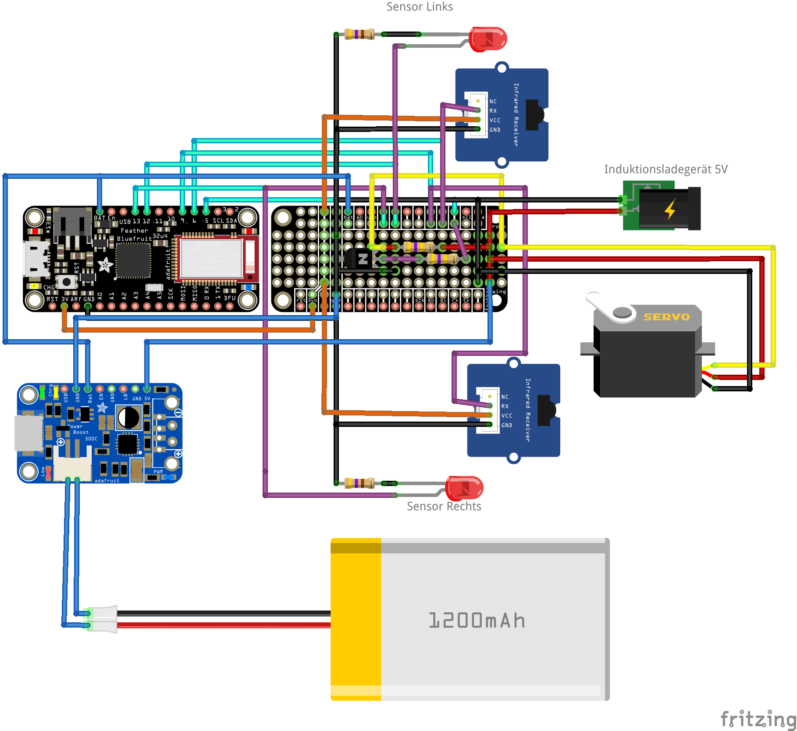
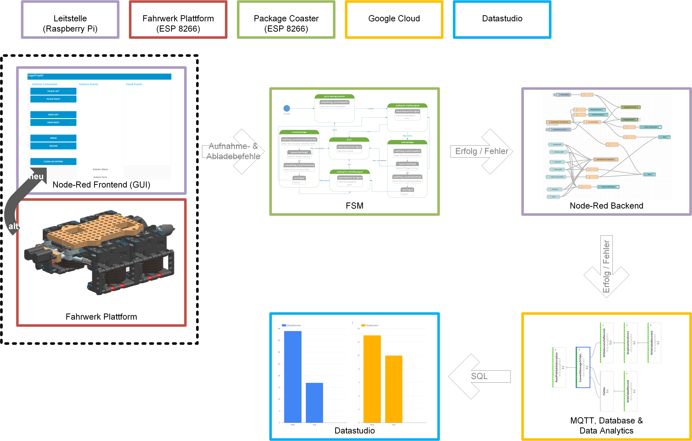
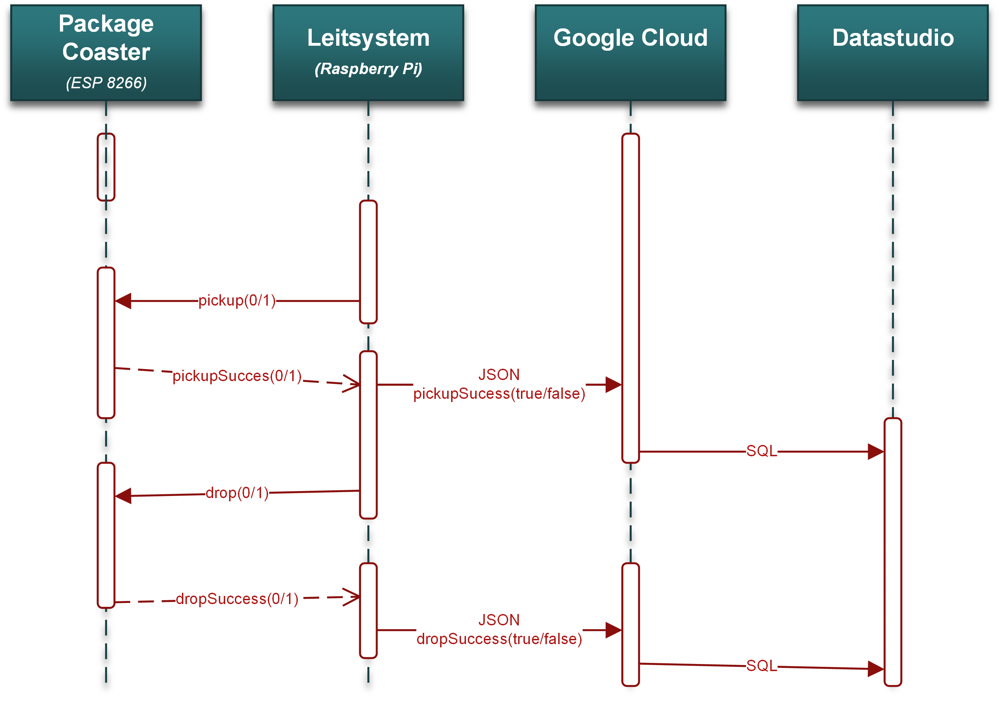
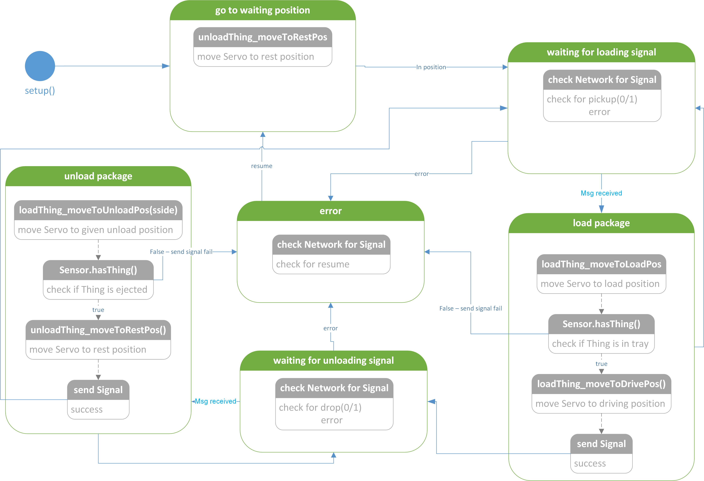
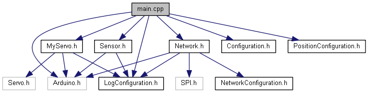

# Smart Factory - Arm

Im Rahmen des Moduls PLMSys soll ein einfaches IoT (Internet of Things) Produkt  
entwickelt und in Betrieb genommen werden, das die gesamte Kommunikations-  
Kette vom Sensor in die Cloud (IoT Stack) und schliesslich in einem PLM System  
kommuniziert. Auf diese Weise wird über das Semester die gesamte Prozesskette  
des Closed-Loop-PLM (Design – Produktion – Nutzung – Feedback ins Design) einmal  
durchlaufen.

## Problemstellung

Für die Sortieranlage Soritc 150 ist ein neues Modul zu entwickeln. Neben der aktuellen  
«High-End» Variante mit einem Roboterarm zum Aufnehmen und ablegen der  
Objekte soll eine kostengünstige, einfache Variante angeboten werden. 

Das zu entwickelnde Modul muss 100% mit der aktuellen Plattform kompatibel sein.

## Software

 [PlatformIo](https://platformio.org/platformio-ide)  for VSCode

[Doxygen](http://www.doxygen.nl/) for Documentation

## Hardware 

[ADAFRUIT FEATHER M0 BLUEFRUIT LE](https://www.adafruit.com/product/2995) 

[Modelcraft Standard-Servo RS-22 YMB Digital-Servo](https://www.conrad.ch/de/p/modelcraft-standard-servo-rs-22-ymb-digital-servo-getriebe-material-metall-stecksystem-jr-209154.html)

[Grove - Digital Distance Interrupter 0.5 to 5cm](http://wiki.seeedstudio.com/Grove-Digital_Distance_Interrupter_0.5_to_5cm-GP2Y0D805Z0F_P/)

## Lösung 
### CAD  Solution

### Elektrisches Konzept

 

### Communication Overview

### FSM

### Dependencie graph 

## Contributors

- Luca Mazzoleni luca.mazzoleni@hsr.ch
- Luciano Bettinaglio luciano.bettinaglio@hsr.ch
- Patrick Zellweger patrick.zellweger@hsr.ch

